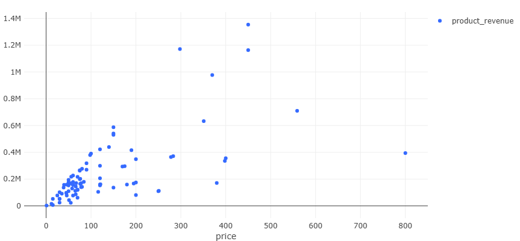
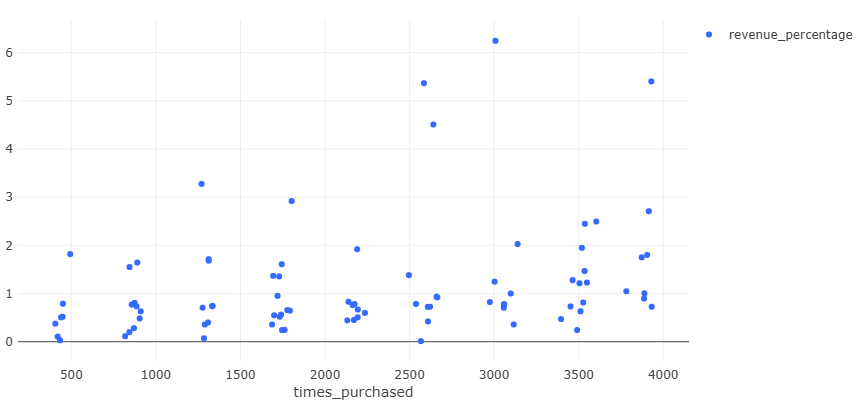
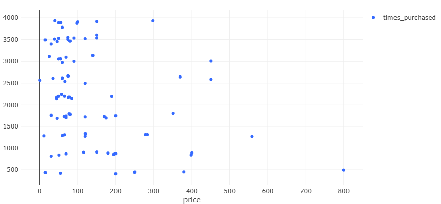
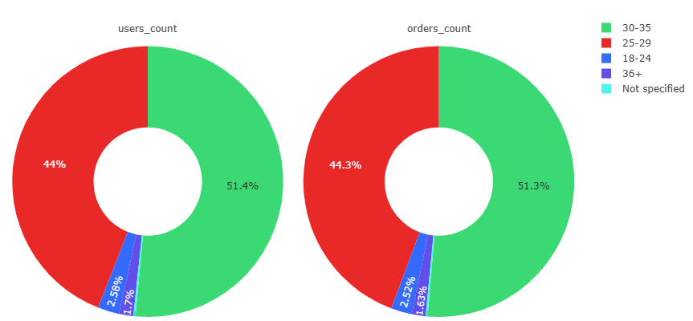
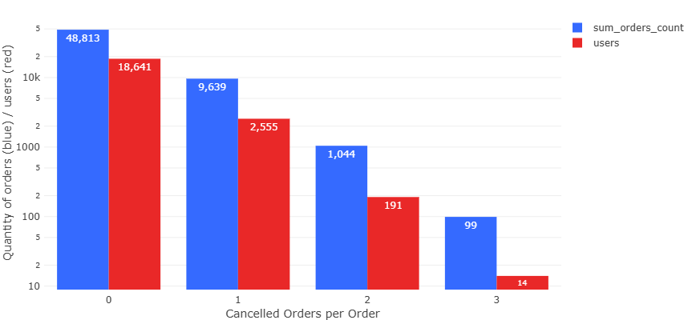
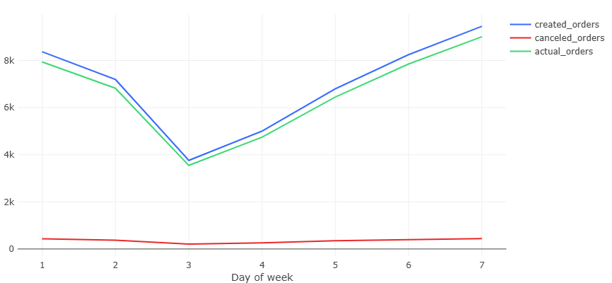
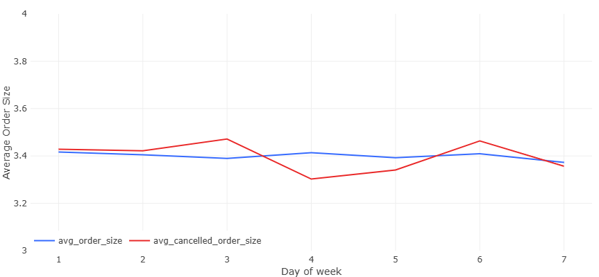

# 📊 Анализ данных E-commerce сервиса доставки на SQL

[](https://www.postgresql.org/)
[](https://powerbi.microsoft.com/)
[](https://redash.io/)

Проект аналитики данных онлайн-сервиса доставки товаров с исследованием с помощью SQL и статистики.

## 🎯 Цели проекта
1. Провести исследовательский анализ данных (EDA) для выявления общих ключевых закономерностей в поведении пользователей и временных трендов бизнес-показателей

2. Реализовать расчет основных продуктовых метрик:
   - Коэффициент конверсии (CR)
   - DAU, WAU, MAU
   - Средний чек (AOV)
   - Retention Rate
   - LTV и CAC (где применимо)

3. Проверить статистические гипотезы:
   - Сравнение средних значений ключевых метрик между группами
   - Оценка значимости различий (t-тест и p-value)
   
4. Демонстрация навыков написания SELECT-запросов разного уровня сложности с  ипользованием: фильтрации, группировки, сортировки, объединений (joins), позапросов и CTE и оконных функций. Также применение транзакций и оптимизации запросов. 

## Сдержание
- [📊 Анализ данных E-commerce сервиса доставки на SQL](#-анализ-данных-e-commerce-сервиса-доставки-на-sql)
  * [🎯 Цели проекта](#-цели-проекта)
  * [🛠 Технологический стек](#-технологический-стек)
  * [📁 Описание датасета](#-описание-датасета)
  * [🚀 Исследование](#-исследование)
    + [1. Анализ среднего времени доставки](#1-анализ-среднего-времени-доставки)
    + [2. Анализ товаров и их продаж](#2-анализ-товаров-и-их-продаж)
      - [1. Выручка](#1-выручка)
      - [2. Какие пары товаров покупают чаще всего (SELF JOIN)](#2-какие-пары-товаров-покупают-чаще-всего-self-join)
    + [3. Анализ пользователей](#3-анализ-пользователей)
      - [1. Возрастные группы](#1-возрастные-группы)
      - [2. Cредний размер заказа по выходным и будням](#2-средний-размер-заказа-по-выходным-и-будням)
      - [3. Общее количество оформленных и отмененных заказов по дням недели.](#3-общее-количество-оформленных-и-отмененных-заказов-по-дням-недели)
      - [4. Средний чек (по пользователям и по заказам)](#4-средний-чек-(по-пользователям-и-по-заказам))
      - [5. Кто оформлял и доставлял самые большие заказы](#5-кто-оформлял-и-доставлял-самые-большие-заказы)
    + [4. Временные тренды бизнес-показателей](#4-временные-тренды-бизнес-показателей)


## 🛠 Технологический стек
| Категория       | Инструменты                          |
|-----------------|--------------------------------------|
| База данных     | PostgreSQL 16                        |
| Аналитика       | SELECT-запросы, CTE, оконные функции    |
| Визуализация    | Redash (экспресс-анализ), Power BI (финальные дашборды) |
| Дополнительно   | Python (Jupyter Notebook) для предобработки данных |

## 📁 Описание датасета
Данные от учебного E-commerce сервиса доставки товаров. 
__Состав данных__:

| Таблица           | Описание                                 |  Поля                |
|-------------------|-----------------------------------------|------------------------------|
| `orders`          | Заказы                                  | order_id, creation_time, product_ids |
| `users`           | Пользователи                            | user_id, sex, birth_date |
| `couriers`           | Курьеры                            | courier_id, sex, birth_date |
| `products`        | Товарный каталог                        | product_id, name, price |
| `courier_actions`      | Действия курьеров                         | order_id, courier_id, action, time |
| `user_actions`    | Действия пользователей                  | order_id, user_id, action, time|

__ER-диограмма__:


Общедоступный набор данных взят из материалов  [Симулятора SQL](https://karpov.courses/simulator-sql?_gl=1*rssps2*_ga*MjExOTE4NjQ3OS4xNzM5ODMwMzAy*_ga_DZP7KEXCQQ*MTc0MjY2MTMzOS4xMzMuMS4xNzQyNjYxMzc1LjI0LjAuMA..).

## 🚀 Исследование
### 1. Анализ среднего времени доставки
> __Постановка задачи__: Вычислить среднее время доставки для двух групп заказов --- "больших" и "малых" --- и сравнить их, определить является разница статистически значимой.

- Сперва узнаем количество неотмененных заказов, и вычисления будет проводить только для таких заказов:
```sql
with u2 AS (
    SELECT COUNT(DISTINCT order_id) AS all_orders
    FROM user_actions
)

SELECT  COUNT(u1.order_id) AS uncancelled_orders, 
        (SELECT * FROM u2) -  COUNT(u1.order_id) AS cancelled_orders,
        (SELECT * FROM u2),
        COUNT(u1.order_id)::NUMERIC / (SELECT * FROM u2) * 100 AS percantage_of_uncancelled
FROM user_actions u1
WHERE order_id NOT IN (
    SELECT order_id FROM user_actions
    WHERE action = 'cancel_order'
)
```
| uncancelled_orders | cancelled_orders | all_orders | percantage_of_uncancelled |
|--------------------|------------------|------------|---------------------------|
| 56616              | 2979             | 59595      | 95.00125849484017         |

- **Максимальное и мнимальное количество товаров в заказах** для проверки на выбросы:
```sql
SELECT  MIN(array_length(product_ids, 1)) AS min_order_size,
        MAX(array_length(product_ids, 1)) AS max_order_size
FROM orders
WHERE order_id NOT IN (
    SELECT order_id FROM user_actions
    WHERE action = 'cancel_order'
)
```
| min_order_size | max_order_size |  
|--------------------|------------|
|              1 | 9 

- **Анализ распределения количества товаров**: Теперь поймем, какие заказы считать "большими" и "малыми". Построим гистограмму распределения количества заказов по количеству товаров в заказах. Найдем статистические показатели, и выберем в качестве порога для больших заказов 75%-квартиль:
```sql
with count_goods AS (
    SELECT  order_id, 
            array_length(product_ids, 1) AS order_size,
            MAX(array_length(product_ids, 1)) OVER() AS max_order_size,
            MIN(array_length(product_ids, 1)) OVER() AS min_order_size
    FROM orders
    WHERE order_id NOT IN (
        SELECT order_id FROM user_actions
        WHERE action = 'cancel_order'
    )
    ORDER BY order_id
    
), stats AS (
    SELECT  PERCENTILE_CONT(0.75) WITHIN GROUP (ORDER BY order_size) AS percentile,
            ROUND(AVG(order_size), 2) AS avg_order_size
    FROM count_goods
)


SELECT  order_size,
        COUNT(order_id) AS count_orders,
        ROUND(COUNT(order_id) / SUM(COUNT(order_id)) OVER() * 100, 2) AS quantity_percent,
        SUM(COUNT(order_id)) OVER() AS all_orders,
        (SELECT percentile FROM stats) AS perc_75,
        (SELECT avg_order_size FROM stats) AS avg_order_size
FROM count_goods
GROUP BY order_size
ORDER BY order_size ASC
```
| order_size | count_orders | quantity_percent | all_orders | perc_75 | avg_order_size |
|------------|--------------|------------------|------------|---------|----------------|
| 1          | 3156         | 5.57             | 56616      | 4.0     | 3.4            |
| 2          | 11255        | 19.88            | 56616      | 4.0     | 3.4            |
| 3          | 16956        | 29.95            | 56616      | 4.0     | 3.4            |
| 4          | 14323        | 25.3             | 56616      | 4.0     | 3.4            |
| 5          | 7665         | 13.54            | 56616      | 4.0     | 3.4            |
| 6          | 2632         | 4.65             | 56616      | 4.0     | 3.4            |
| 7          | 556          | 0.98             | 56616      | 4.0     | 3.4            |
| 8          | 68           | 0.12             | 56616      | 4.0     | 3.4            |
| 9          | 5            | 0.01             | 56616      | 4.0     | 3.4            |


Как видим, количество больших заказов составляет чуть менее 20% от общего числа заказов.
- Расчитаем среднее времени доставки и пометим заказы как большие и малые:
```sql
with tab AS (
    SELECT order_id
    FROM   courier_actions
    WHERE  action = 'accept_order'

        AND order_id not in (
            SELECT order_id
            FROM   user_actions
            WHERE  action = 'cancel_order')
)  

SELECT  order_id,
        CASE 
            WHEN array_length(product_ids, 1) > 5 THEN 'large' 
            ELSE 'small' 
        END AS order_size,
        MIN(time) as time_accepted,
        MAX(time) as time_delivered,
        DATE(MIN(time)) AS start_date,
        ROUND(extract(epoch FROM age(max(time), min(time)))::decimal / 60, 0)::INTEGER AS delivery_time
FROM   courier_actions
LEFT JOIN orders USING(order_id) 
WHERE  order_id in (SELECT order_id FROM tab)
GROUP BY order_id, product_ids
ORDER BY order_id
```
| order_id | order_size | time_accepted  | time_delivered | delivery_time |
|----------|------------|----------------|----------------|---------------|
| 1        | small      | 24/08/22 01:52 | 24/08/22 02:15 | 24            |
| 2        | small      | 24/08/22 06:37 | 24/08/22 06:56 | 18            |
| 3        | small      | 24/08/22 07:35 | 24/08/22 07:54 | 19            |
| 4        | small      | 24/08/22 10:39 | 24/08/22 10:58 | 19            |
| 5        | small      | 24/08/22 12:34 | 24/08/22 12:59 | 24            |

Посмотрим на изменение среднего времени доставки всех заказов по дням, добавив запрос:
```sql
SELECT  DATE(time_accepted) AS start_date,
        AVG(delivery_time) AS avg_delivery_time
FROM time
GROUP BY start_date
ORDER BY start_date

```


Теперь посчитаем статистические показатели для обоих групп:
```sql
SELECT  PERCENTILE_CONT(0.5) WITHIN GROUP (ORDER BY delivery_time) AS median,

    -- small orders
    COUNT(CASE WHEN order_size = 'small' THEN 1 END) AS orders_count_small,
    ROUND(AVG(CASE WHEN order_size = 'small' THEN delivery_time END), 2) AS mean_small,
    STDDEV(CASE WHEN order_size = 'small' THEN delivery_time END) AS std_small,
    MIN(CASE WHEN order_size = 'small' THEN delivery_time END) AS min_small,
    MAX(CASE WHEN order_size = 'small' THEN delivery_time END) AS max_small,
    
    -- large orders
    COUNT(CASE WHEN order_size = 'large' THEN 1 END) AS orders_count_large,
    ROUND(AVG(CASE WHEN order_size = 'large' THEN delivery_time END), 2) AS mean_large,
    STDDEV(CASE WHEN order_size = 'large' THEN delivery_time END) AS std_large,
    MIN(CASE WHEN order_size = 'large' THEN delivery_time END) AS min_large,
    MAX(CASE WHEN order_size = 'large' THEN delivery_time END) AS max_large
    
FROM time
```

| median | orders_count_small | mean_small | std_small          | min_small | max_small | orders_count_large | mean_large | std_large         | min_large | max_large |
|--------|--------------------|------------|--------------------|-----------|-----------|--------------------|------------|-------------------|-----------|-----------|
| 20.0   | 45690              | 19.96      | 3.03 | 5         | 32        | 10926               | 20.04      | 3.00 | 10        | 30        |

Замечаем, что медианное значение и среднее практически не отличаются, а среднее время доставки для двух групп практически одинаковое. Если построим гистограмму количества заказов по количеству минут, затраченных на доставку, для обоих групп, то увидим явно выраженное __нормальное распределение__:
```sql
SELECT  delivery_time,
        COUNT(order_id) FILTER (WHERE order_size = 'large') as orders_count_large,
        COUNT(order_id) FILTER (WHERE order_size = 'small') as orders_count_small
FROM time
GROUP BY delivery_time
ORDER BY delivery_time
```


- __Проведение статистического теста в SQL__

  - Итак, средние в двух группах `19.86` и `20.16`, что вряд ли имеет практическую значимость для бизнеса. Но в эксперементальных учебных целях проведем __z-тест__ с использованием и оценим статистическую и практическую значимость различий непосредственно в SQL, используя необходимые формулы, что необычно, ведь статистические тесты проводятся обычно с помощью Python (scipy, stats, pandas). 
  - Проводим __двусторонний независимый z-тест__, поскольку: 
    - Размер группы с "большими" заказами составляет `> 10%` данных, что позволяет провести достаточно надежный статистический тест;
    -   Выборки независимые;
    - Данные нормально распределены;
    - Объёмы выборок очень большие (n > 30)
    - Результаты  на больших n практически совпадают с результатами __t-теста__, но в случае __z-теста__ расчеты гораздо проще реализовать в SQL.	

  - **Формулировка гипотез:**
    -   **$H_0$:**  Среднее время доставки одинаково для обеих групп ($avg_1 = avg_2$).
    -   **$H_1$:**  Среднее время доставки различается ($avg_1 \neq avg_2$).

  - **Уровень значимости ($\alpha$)**  — это вероятность отвергнуть нулевую гипотезу ($H_0$), когда она верна (ошибка I рода). **Стандартный выбор:**  $\alpha = 0.05$  (5%) →  **95% доверительный интервал**. 

  - **Доверительный интервал**:

  $$\text{DI} = (\overline{X_1}-\overline{X_2}) \pm z_{\alpha/2} \cdot SE$$

    где $z_{\alpha/2} \approx 1.96$ - критическое значение z-критерия для двустороннего теста с α = 0.05 (для 95% ДИ), $SE$ - стандартная ошибка разницы средних:

  $$SE = \sqrt{\frac{s_1^2}{n_1} + \frac{s_2^2}{n_2}}$$

  - **z-статистика**:

  $$z = \frac{\bar{X}_1 - \bar{X}_2}{SE}$$

  - **p-value**:

  $$p\text{-value} = 2 \cdot (1 - \Phi(|z|))$$

  - **Размер эффекта Cohen’s d** - стандартизированная мера размера эффекта, которая помогает понять, **насколько важны различия между группами** не только с точки зрения статистики, но и с точки зрения практической ценности:

  $$d = \frac{\left|\overline{X_1} - \overline{X_2} \right|}{s_{\text{pooled}}}$$

    Где:

  $$s_{\text{pooled}} = \sqrt{\frac{(n_1 - 1)s_1^2 + (n_2 - 1)s_2^2}{n_1 + n_2 - 2}}$$

  - Из-за отсутсвия поддержки функции CDF проведем **аппроксимацию Абрамовица и Стегуна** прямо в SQL-запросе по формуле:

  $$\Phi(z) \approx
  \begin{cases}
  	1 - \phi (z) \cdot \left(a_1 t + a_2 t^2 + a_3 t^3 + a_4 t^4 + a_5 t^5\right), & z \geq 0 \\
  	\phi (z) \cdot \left(a_1 t + a_2 t^2 + a_3 t^3 + a_4 t^4 + a_5 t^5\right), & z < 0
  \end{cases}$$

  - Целиком весь запрос:

```sql
with tab AS (
    SELECT order_id
    FROM   courier_actions
    WHERE  action = 'accept_order'
        AND order_id not in (
            SELECT order_id
            FROM   user_actions
            WHERE  action = 'cancel_order')

), time AS (
    SELECT  order_id,
            CASE 
                WHEN array_length(product_ids, 1) > 5 THEN 'large' 
                ELSE 'small' 
            END AS order_size,
            MIN(time) as time_accepted,
            MAX(time) as time_delivered,
            DATE(MIN(time)) AS start_date,
            ROUND(extract(epoch FROM age(max(time), min(time)))::decimal / 60, 0)::INTEGER AS delivery_time
    FROM   courier_actions
    LEFT JOIN orders USING(order_id) 
    WHERE  order_id in (SELECT order_id FROM tab)
    GROUP BY order_id, product_ids
    ORDER BY order_id
    
), avg_vs_date AS (
    SELECT  start_date,
            AVG(delivery_time) AS avg_delivery_time
    FROM time
    GROUP BY start_date
    ORDER BY start_date

), orders_count_via_time AS (
    SELECT  delivery_time,
            COUNT(order_id) FILTER (WHERE order_size = 'large') as orders_count_large,
            COUNT(order_id) FILTER (WHERE order_size = 'small') as orders_count_small
    FROM time
    WHERE delivery_time > 4
    GROUP BY delivery_time
    ORDER BY delivery_time

), stats AS (
    SELECT  PERCENTILE_CONT(0.5) WITHIN GROUP (ORDER BY delivery_time) AS median,

        -- small orders
        COUNT(CASE WHEN order_size = 'small' THEN 1 END) AS orders_count_small,
        ROUND(AVG(CASE WHEN order_size = 'small' THEN delivery_time END), 2) AS mean_small,
        STDDEV(CASE WHEN order_size = 'small' THEN delivery_time END) AS std_small,
        MIN(CASE WHEN order_size = 'small' THEN delivery_time END) AS min_small,
        MAX(CASE WHEN order_size = 'small' THEN delivery_time END) AS max_small,
        
        -- large orders
        COUNT(CASE WHEN order_size = 'large' THEN 1 END) AS orders_count_large,
        ROUND(AVG(CASE WHEN order_size = 'large' THEN delivery_time END), 2) AS mean_large,
        STDDEV(CASE WHEN order_size = 'large' THEN delivery_time END) AS std_large,
        MIN(CASE WHEN order_size = 'large' THEN delivery_time END) AS min_large,
        MAX(CASE WHEN order_size = 'large' THEN delivery_time END) AS max_large
        
    FROM time
    
), z_test AS (
    SELECT
        mean_small,
        mean_large,
        SQRT(
            (std_small^2 * orders_count_small + std_large^2 * orders_count_large)
            / (orders_count_small + orders_count_large)
        ) AS pooled_std,
        SQRT(POWER(std_small, 2)/orders_count_small + POWER(std_large, 2)/orders_count_large) AS se,
        (mean_large - mean_small) / (SQRT(POWER(std_small, 2)/orders_count_small + POWER(std_large, 2)/orders_count_large)) AS z_score,
        1 / (1 + 0.2316419 * ABS((mean_large - mean_small) / (SQRT(POWER(std_small, 2)/orders_count_small + POWER(std_large, 2)/orders_count_large)))) AS t 
    FROM stats
)

-- SELECT * FROM stats;

-- SELECT * FROM time;

SELECT
  -- Разница средних
  mean_large - mean_small AS mean_diff,
  
  -- Cohen’s d
  ABS(mean_large - mean_small) / pooled_std AS cohen_d,
  
  -- 95% ДИ
  (mean_large - mean_small) - 1.96 * se AS ci_lower,
  (mean_large - mean_small) + 1.96 * se AS ci_upper,
  
  -- z-статистика и p-value
  z_score,
  2 * (1 - (
    CASE 
        WHEN z_score >= 0 THEN
            1 - (1 / SQRT(2 * PI())) * EXP(-(z_score^2)/2) * 
            (0.319381530 * t - 0.356563782 * t^2 + 1.781477937 * t^3 - 1.821255978 * t^4 + 1.330274429 * t^5)
        ELSE
            (1 / SQRT(2 * PI())) * EXP(-(z_score^2)/2) * 
            (0.319381530 * t - 0.356563782 * t^2 + 1.781477937 * t^3 - 1.821255978 * t^4 + 1.330274429 * t^5)
    END
    )) AS p_value
  
FROM z_test
```
- Результат:

	| mean_diff | cohen_d              | ci_lower             | ci_upper            | z_score            | p_value             |
	|-----------|----------------------|----------------------|---------------------|--------------------|---------------------|
	| 0.08      | 0.026  | -0.026| 0.20 | 1.47 | 0.14 |

- Выводы:
	- Так как  **1.48 < z_crit = 1.96**, разница  **не достигает статистической значимости**  на уровне 5%.
	- **p-value = 0.14 > 0.05** - вероятность получить такую разницу (или больше) между группами, если на самом деле её нет (нулевая гипотеза верна), составляет **14%**. →  **нет оснований отвергать нулевую гипотезу**.
	- Разница статистически **не значима**.
	- Размер эффекта составляет **0.03 стандартных отклонения < 0.2** - -   → эффект  **пренебрежимо мал**. Даже если бы разница была значимой, её  **практический смысл отсутствует**.

 -----------
 -----------
 
 ## 2. Анализ товаров и их продаж
 #### 1. Выручка
 1. Определить количество продаж для каждого товара, выручку по каждому товару, общую выручку из таблицы `orders`, учитывая только неотмененные заказы. Также оценить корреляцию между: 
    - ценой и количеством продаж
    - ценой и выручкой
    - количесвтом продаж и выручкой
 
     __Запрос__:
```sql
SELECT  product_id,
        name,
        price,
        times_purchased,
        price * times_purchased AS product_revenue,
        SUM(price * times_purchased) OVER () AS total_revenue,
        price * times_purchased / SUM(price * times_purchased) OVER() * 100 AS revenue_percentage,
        CORR(price, times_purchased) OVER() AS price_sales_corr,
        CORR(price, price * times_purchased) OVER() AS price_revenue_corr,
        CORR(times_purchased, price * times_purchased) OVER() AS sales_revenue_corr
FROM    (
    SELECT UNNEST(product_ids) AS product_id,
           COUNT(*) AS times_purchased
    FROM   orders
    WHERE  order_id NOT IN (SELECT order_id
                            FROM   user_actions
                            WHERE  action = 'cancel_order')
    GROUP BY product_id
    ORDER BY times_purchased DESC
) t
LEFT JOIN products USING(product_id)
ORDER BY revenue_percentage DESC
```
   __Результат__:
   | product_id | name            | price | times_purchased | product_revenue | total_revenue | revenue_percentage | price_sales_corr     | price_revenue_corr | sales_revenue_corr |
|------------|-----------------|-------|-----------------|-----------------|---------------|--------------------|----------------------|--------------------|--------------------|
| 57         | свинина         | 450   | 3008            | 1353600         | 21679095      | 6.24  | -0.32 | 0.64 | 0.30 |
| 77         | курица          | 298   | 3930            | 1171140         | 21679095      | 5.40  | -0.32 | 0.64 | 0.30 |
| 15         | масло оливковое | 450   | 2585            | 1163250         | 21679095      | 5.36  | -0.32 | 0.64 | 0.30 |
| 66         | говядина        | 370   | 2641            | 977170          | 21679095      | 4.51  | -0.32 | 0.64 | 0.30 |
| 37         | баранина        | 559   | 1270            | 709930          | 21679095      | 3.27  | -0.32 | 0.64 | 0.30 |

- __Scatter-plots__:

  
  
 #### **1.  `price_revenue_corr = 0.64`  (Цена vs Выручка)**

-   **Положительная корреляция**: Чем выше цена, тем больше выручка.
    
-   **Сила связи**: Сильная (0.5–0.7 — значимая).
    
-   **Парадокс**: Несмотря на снижение количества продаж при росте цены, выручка растет. Это означает, что  **дорогие товары компенсируют низкий спрос высокой маржой**.

----------

   

#### **2.  `sales_revenue_corr = 0.3`  (Количество продаж vs Выручка)**

-   **Слабая положительная корреляция**: Больше продаж → чуть выше выручка, но зависимость незначительна.
    
-   **Причина**: Дешевые товары продаются чаще, но их вклад в выручку мал. Дорогие товары дают больший вклад даже при редких продажах.

----------

   

   #### **3.  `price_sales_corr = -0.32`  (Цена vs Количество продаж)**

-   **Отрицательная корреляция**: Увеличение цены связано со снижением количества продаж.
    
-   **Сила связи**: Умеренная (по шкале Чеддока: 0.3–0.5 — заметная, но не сильная).
    
-   **Пример**: Если цена товара вырастает на 10%, количество покупок снижается в среднем на ~3.2% (при прочих равных).

----------

### **Ключевые выводы**:
1. __Основной__: 
Магазин демонстрирует сильную зависимость выручки от высокомаржинальных товаров. Несмотря на снижение спроса при росте цены (r = -0.32), дорогие товары обеспечивают 64% вариации выручки. Рекомендуется развивать премиум-сегмент, но диверсифицировать ассортимент для снижения рисков.
3.  **Стратегия ценообразования работает**:
    
    -   Магазин получает основную выручку за счет  **дорогих товаров**  с высокой маржой, несмотря на их низкий спрос.
        
    -   Дешевые товары играют роль "массового сегмента", но их вклад в выручку ограничен.
        
4.  **Риски**:
    
    -   Зависимость от небольшой группы дорогих товаров: если их спрос упадет, выручка резко снизится.
        
    -   Низкая диверсификация: 87 товаров — малая выборка для устойчивой модели.
 
-----------

#### 2. Какие пары товаров покупают чаще всего (SELF JOIN)

```sql
-- какие пары товаров покупают вместе чаще всего

WITH main_table AS (
    SELECT  DISTINCT order_id,
            product_id,
            name
    FROM (
        SELECT  order_id,
                unnest(product_ids) as product_id
        FROM orders
        WHERE order_id NOT IN (
            SELECT order_id
            FROM   user_actions
            WHERE  action = 'cancel_order'
        )
    ) t
    LEFT JOIN products using(product_id)
    ORDER BY order_id, name
)
    
SELECT pair,
       count(order_id) as count_pair
FROM (
    SELECT  DISTINCT a.order_id,
            CASE 
                WHEN a.name > b.name THEN string_to_array(concat(b.name, '+', a.name), '+')
                ELSE string_to_array(concat(a.name, '+', b.name), '+') 
            END AS pair
    FROM main_table a 
    JOIN main_table b
        ON a.order_id = b.order_id 
        AND a.name != b.name
) t
GROUP BY pair
ORDER BY count_pair desc, pair
```

| pair                                                    | count_pair |
|---------------------------------------------------------|------------|
| ['курица', 'хлеб']                                      | 249        |
| ['сахар', 'хлеб']                                       | 237        |
| ['батон', 'хлеб']                                       | 235        |
| ['кофе 3 в 1', 'чай черный в пакетиках']                | 235        |
| ['курица', 'сахар']                                     | 233        |

------
-----------
 
## 3. Анализ пользователей

#### 1. Возрастные группы

Разобьем  пользователей из таблицы  `users`  на возрастные группы, с целью определить, какая группа людей:
- самая многочисленная,
- делает наибольшее количество заказов,
- обладает в среднем наиболее большими заказами.

 Для того, чтобы изъять необхожимую информацию не обходимо объединить три таблицы `orders`, `users` и `user_actions` с помощью `JOIN`. Сперва построим такую таблицу, учитывая только неотмененные заказы:

```sql
	 SELECT o.order_id, 
            ARRAY_LENGTH(o.product_ids, 1) AS order_length, 
            u.user_id, 
            coalesce(TO_CHAR(birth_date, 'DD/MM/YYYY'), 'Not specified') AS birth_date,
            case 
                when date_part('year', age('2022-12-12'::DATE, birth_date)) between 18 and 24 then '18-24'
                when date_part('year', age('2022-12-12'::DATE, birth_date)) between 25 and 29 then '25-29'
                when date_part('year', age('2022-12-12'::DATE, birth_date)) between 30 and 35 then '30-35'
                when date_part('year', age('2022-12-12'::DATE, birth_date)) >= 36 then '36+'
                else 'Not specified'
            end as group_age
            
    FROM orders o
    INNER JOIN user_actions ua 
        ON o.order_id = ua.order_id
    INNER JOIN users u
        ON ua.user_id = u.user_id
    WHERE o.order_id NOT IN (
        SELECT order_id FROM user_actions
        WHERE action = 'cancel_order'
    )
```
Пример результата:
| order_id | order_length | user_id | birth_date | group_age |
|----------|--------------|---------|------------|-----------|
| 2        | 4            | 2       | 18/06/1993 | 25-29     |
| 4        | 3            | 4       | 17/11/1991 | 30-35     |
| 6        | 5            | 6       | 05/12/1993 | 25-29     |
| 8        | 1            | 8       | 28/10/1992 | 30-35     |
| 9        | 6            | 9       | 20/07/1989 | 30-35     |

Теперь, беря в CTE эту таблицу за основу, можем сделать группировку и найти интересующие нас показатели:

```sql
WITH t1 AS (
    SELECT  o.order_id, 
            ARRAY_LENGTH(o.product_ids, 1) AS order_length, 
            u.user_id, 
            coalesce(TO_CHAR(birth_date, 'DD/MM/YYYY'), 'Not specified') AS birth_date,
            case 
                when date_part('year', age('2022-12-12'::DATE, birth_date)) between 18 and 24 then '18-24'
                when date_part('year', age('2022-12-12'::DATE, birth_date)) between 25 and 29 then '25-29'
                when date_part('year', age('2022-12-12'::DATE, birth_date)) between 30 and 35 then '30-35'
                when date_part('year', age('2022-12-12'::DATE, birth_date)) >= 36 then '36+'
                else 'Not specified'
            end as group_age
            
    FROM orders o
    INNER JOIN user_actions ua 
        ON o.order_id = ua.order_id
    INNER JOIN users u
        ON ua.user_id = u.user_id
    WHERE o.order_id NOT IN (
        SELECT order_id FROM user_actions
        WHERE action = 'cancel_order'
    )
)

SELECT  group_age, 
        COUNT(DISTINCT user_id) AS users_count,
        COUNT(order_id) AS orders_count,
        SUM(COUNT(DISTINCT user_id)) OVER()::INTEGER AS total_users_count,
        SUM(COUNT(order_id)) OVER()::INTEGER AS total_orders_count, 
        ROUND(AVG(order_length), 2) AS avg_orders_len

FROM t1
GROUP BY group_age
ORDER BY group_age
```
Результат:
| group_age     | users_count | orders_count | total_users_count | total_orders_count | avg_orders_len |
|---------------|-------------|--------------|-------------------|--------------------|----------------|
| 18-24         | 516         | 1350         | 20034             | 53670              | 3.44           |
| 25-29         | 8821        | 23771        | 20034             | 53670              | 3.39           |
| 30-35         | 10306       | 27542        | 20034             | 53670              | 3.41           |
| 36+           | 341         | 873          | 20034             | 53670              | 3.41           |
| Not specified | 50          | 134          | 20034             | 53670              | 3.29           |



**Вывод**:

Наибольшее количество людей, пользующихся услугами сервиса, находятся в возрасте 25-35 лет и обеспечивают основной спрос на сервисе (~ 95%). Средний размер заказа практически одинаков для всех возрастных групп.

---

#### 2. Cредний размер заказа по выходным и будням
По данным из таблицы  `orders`  рассчитаем  средний размер заказа по выходным и будням, и определим является ли разница значимой.

```sql
SELECT case when to_char(creation_time, 'Dy') in ('Sat', 'Sun') then 'weekend'
            else 'weekdays' end as week_part,
       round(avg(array_length(product_ids, 1)), 2) as avg_order_size
FROM   orders
GROUP BY week_part
ORDER BY avg_order_size asc
```
| week_part | avg_order_size |
|-----------|----------------|
| weekend   | 3.39           |
| weekdays  | 3.4            |

Разница незначима.

#### 3. Общее количество оформленных и отмененных заказов по дням недели. 

**а)** Сперва для каждого пользователя в таблице `user_actions`  посчитаем общее количество оформленных заказов и долю отменённых заказов. 

```sql
SELECT  user_id,
            COUNT(DISTINCT order_id) FILTER (WHERE action = 'cancel_order') AS cancel_orders,
            COUNT(DISTINCT order_id) AS orders_count,
            ROUND(COUNT(DISTINCT order_id) FILTER (WHERE action = 'cancel_order')::DECIMAL / COUNT(DISTINCT order_id), 2) AS cancel_rate
    FROM user_actions
    GROUP BY user_id
```
Пример результата:
| user_id | cancel_orders | orders_count | cancel_rate |
|---------|---------------|--------------|-------------|
| 1       | 0             | 4            | 0.0         |
| 2       | 0             | 2            | 0.0         |
| 3       | 0             | 4            | 0.0         |
| 4       | 0             | 2            | 0.0         |
| 5       | 0             | 1            | 0.0         |

Сгруппируем по количеству отмененных заказов, и найдем количество заказов с таким количеством отмены, и количество пользователей, совершивших столько отмен, а также отыщем среднее по `cancel_rate`:

```sql
WITH t1 AS (
    SELECT  user_id,
            COUNT(DISTINCT order_id) FILTER (WHERE action = 'cancel_order') AS cancel_orders,
            COUNT(DISTINCT order_id) AS orders_count,
            ROUND(COUNT(DISTINCT order_id) FILTER (WHERE action = 'cancel_order')::DECIMAL / COUNT(DISTINCT order_id), 2) AS cancel_rate,
            SUM(COUNT(DISTINCT order_id)) OVER() AS total_orders,
            SUM(COUNT(DISTINCT order_id) FILTER (WHERE action = 'cancel_order')) OVER() AS total_cancels
    FROM user_actions
    GROUP BY user_id
)

SELECT  cancel_orders,
        SUM(orders_count)::INTEGER AS sum_orders_count,
        COUNT(user_id) AS users,
        ROUND(AVG(cancel_rate), 2) AS avg_cancel_rate,
        -- (SELECT SUM(cancel_rate) / COUNT(user_id) FROM t1) AS avg_cancel_rate_total,
        -- Взвешенное среднее: общие отмены / общие заказы
        ROUND(total_cancels::DECIMAL / total_orders, 2) AS avg_cancel_rate_total
FROM t1
GROUP BY cancel_orders, total_orders, total_cancels
ORDER BY cancel_orders ASC
```

| cancel_orders | sum_orders_count | users | avg_cancel_rate | avg_cancel_rate_total |
|---------------|------------------|-------|-----------------|-----------------------|
| 0             | 48813            | 18641 | 0.0             | 0.05                  |
| 1             | 9639             | 2555  | 0.38            | 0.05                  |
| 2             | 1044             | 191   | 0.43            | 0.05                  |
| 3             | 99               | 14    | 0.49            | 0.05                  |



**б)** Теперь посмотрим, отличается ли  success rate  (доля неотменённых заказов) и средний размер заказа для отмененных и неотмененных заказов в разные дни недели:

```sql
SELECT  
        date_part('isodow', time)::int as weekday_number,
        to_char(time, 'Dy') as weekday,
        count(ua.order_id) filter (WHERE action = 'create_order') as created_orders,
        count(ua.order_id) filter (WHERE action = 'cancel_order') as canceled_orders,
        count(ua.order_id) filter (WHERE action = 'create_order') 
            - count(ua.order_id) filter (WHERE action = 'cancel_order') as actual_orders,
        round((count(ua.order_id) filter (WHERE action = 'create_order') 
            - count(ua.order_id) filter (WHERE action = 'cancel_order'))::decimal / 
            count(ua.order_id) filter (WHERE action = 'create_order'), 3) as success_rate,
        AVG(array_length(o.product_ids, 1)) FILTER (WHERE action = 'create_order') 
            AS avg_order_size,
        AVG(array_length(o.product_ids, 1)) FILTER (WHERE action = 'cancel_order') 
            AS avg_cancelled_order_size
            
FROM   user_actions ua
INNER JOIN orders o
    ON ua.order_id = o.order_id
WHERE  time >= '2022-08-24'
  and time < '2022-09-07'
GROUP BY weekday_number, weekday
ORDER BY weekday_number
```

| weekday_number | weekday | created_orders | canceled_orders | actual_orders | success_rate | avg_order_size | avg_cancelled_order_size |
|----------------|---------|----------------|-----------------|---------------|--------------|----------------|--------------------------|
| 1              | Mon     | 8374           | 434             | 7940          | 0.948        | 3.41           | 3.43                     |
| 2              | Tue     | 7193           | 370             | 6823          | 0.949        | 3.40           | 3.42                     |
| 3              | Wed     | 3758           | 210             | 3548          | 0.944        | 3.39           | 3.47                     |
| 4              | Thu     | 5004           | 258             | 4746          | 0.948        | 3.41           | 3.30                     |
| 5              | Fri     | 6800           | 352             | 6448          | 0.948        | 3.39           | 3.34                     |
| 6              | Sat     | 8249           | 399             | 7850          | 0.952        | 3.40           | 3.46                     |
| 7              | Sun     | 9454           | 443             | 9011          | 0.953        | 3.37           | 3.35                     |





**Вывод:**

- Доля неотменённых заказов (`success_rate`) и средний размер заказа для отмененных и неотмененных заказов в разные дни недели остается практически на одном и том же уровне, аномалий нет, сервис работает стабильно. 
- Заметно меньше заказов совершается в по средам и четвергам, чаще - в начале и конце недели.

#### 4. Средний чек (по пользователям и по заказам)

**а)** Для начала построим таблицу, в которой рассчитаем общую стоимость каждого заказа, совршенного пользователями. Для этого необходимо сначала "развернуть" таблицу `orders` по столбцу `product_ids`, после этого объединить с помощью `LEFT JOIN` эту развернутую таблицу с таблицей `products`, `user_actions` и `users`:

```sql
-- Средний чек

SELECT  o.order_id,
        u.user_id,
        ARRAY_AGG(p.name) AS product_names,
        ARRAY_LENGTH(o.product_ids, 1) AS order_size,
        SUM(p.price) AS order_price
FROM (
    SELECT order_id, product_ids, unnest(product_ids) AS product_id
    FROM orders
    WHERE order_id NOT IN (
        SELECT order_id FROM user_actions
        WHERE action = 'cancel_order'
    )
) o
LEFT JOIN products p
    ON o.product_id = p.product_id
LEFT JOIN user_actions ua
    ON o.order_id = ua.order_id
LEFT JOIN users u
    ON ua.user_id = u.user_id
GROUP BY o.order_id, o.product_ids, u.user_id
ORDER BY order_price DESC

```

| order_id | user_id | order_price | order_size | product_names                                                                                |
|----------|---------|-------------|------------|----------------------------------------------------------------------------------------------|
| 59374    | 16710   | 2014.00     | 6          | ['свинина', 'лимонад', 'чай черный листовой', 'кофе без кофеина', 'икра', 'морс брусничный'] |
| 44230    | 10951   | 2006.00     | 6          | ['кетчуп', 'курица', 'икра', 'масло оливковое', 'сушки', 'говядина']                         |
| 55638    | 20373   | 1959.00     | 6          | ['говядина', 'свинина', 'баранина', 'вода негазированная', 'масло оливковое', 'сметана']     |
| 33395    | 13807   | 1959.00     | 6          | ['курица', 'икра', 'рис', 'шоколад черный', 'кофе зерновой', 'мед']                          |
| 56492    | 13599   | 1946.00     | 5          | ['икра', 'сосиски', 'кофе растворимый', 'леденцы', 'икра']                                   |

**б)** Группируем по пользователям и узнаем для каждого из них количество заказов, общую стоимость всех заказов и общее количество продуктов, которое было куплено во всех заказах (`t1` - предыдущая таблица):

```sql
SELECT  user_id,
        COUNT(order_id) AS total_orders,
        SUM(order_price) AS total_price,
        SUM(order_size) AS total_products
FROM t1
GROUP BY user_id
ORDER BY total_price DESC, total_orders DESC, user_id ASC
LIMIT 5
``` 

| user_id | total_orders | total_price | total_products |
|---------|--------------|-------------|----------------|
| 3131    | 11           | 6490        | 45             |
| 2567    | 8            | 6296        | 36             |
| 3793    | 17           | 6225        | 58             |
| 451     | 9            | 5890        | 32             |
| 183     | 10           | 5880        | 47             |

Это информация полезна, если захотим поощрить пользование сервисом для самых платежеспособных клиентов сервиса,

**в)** Теперь найдем статистику по этим столбцам

```sql
-- Средний чек (по пользователям)

WITH t1 AS (
    SELECT  o.order_id,
            u.user_id,
            SUM(p.price) AS order_price,
            ARRAY_LENGTH(o.product_ids, 1) AS order_size,
            ARRAY_AGG(p.name) AS product_names
    FROM (
        SELECT order_id, product_ids, unnest(product_ids) AS product_id
        FROM orders
        WHERE order_id NOT IN (
            SELECT order_id FROM user_actions
            WHERE action = 'cancel_order'
        )
    ) o
    LEFT JOIN products p
        ON o.product_id = p.product_id
    LEFT JOIN user_actions ua
        ON o.order_id = ua.order_id
    INNER JOIN users u
        ON ua.user_id = u.user_id
    GROUP BY o.order_id, o.product_ids, u.user_id
    ORDER BY order_price DESC
    
), t2 AS (
    SELECT  user_id,
            COUNT(order_id) AS total_orders,
            SUM(order_price) AS total_price,
            SUM(order_size) AS total_products
    FROM t1
    GROUP BY user_id
    ORDER BY total_price DESC, total_orders DESC, user_id ASC
)

SELECT

    AVG(total_orders) AS avg_total_orders,
    PERCENTILE_CONT(0.5) WITHIN GROUP (ORDER BY total_orders) AS median_orders,
    MIN(total_orders) AS min_total_orders,
    MAX(total_orders) AS max_total_orders,
    
    AVG(total_price) AS avg_total_price,
    PERCENTILE_CONT(0.5) WITHIN GROUP (ORDER BY total_price) AS median_price,
    MIN(total_price) AS min_total_price,
    MAX(total_price) AS max_total_price
    
FROM t2

```

| avg_total_orders   | median_orders | min_total_orders | max_total_orders | avg_total_price    | median_price | min_total_price | max_total_price |
|--------------------|---------------|------------------|------------------|--------------------|--------------|-----------------|-----------------|
| 2.68 | 2.0           | 1                | 17               | 1026.46 | 828.0        | 1               | 6490            |

```sql
    -- средний чек "классический" на основе исходной t1
    SELECT
        
        AVG(order_price) AS avg_total_price,
        PERCENTILE_CONT(0.5) WITHIN GROUP (ORDER BY order_price) AS median_price,
        MIN(order_price) AS min_total_price,
        MAX(order_price) AS max_total_price
        
    FROM t1
```

| avg_total_price   | median_price | min_total_price | max_total_price |
|-------------------|--------------|-----------------|-----------------|
| 383.16 | 321.0        | 1.0               | 2014.0            |


**Вывод:**
  - Пользователь в среднем тратит - 1026, при максимуме - 6490 и медиане 828. Пользователи в основном сделали по 2-3 заказа на сервисе. Распределения нессиметричны - признак ненормальности. Самых платежеспособных клиентов можно поощрить баллами или подарками, дать привелегии, чтобы замотивировать покупать еще.
  - С каждого заказа в среднем сервис полует ~ 380 р. 

#### 5. Кто оформлял и доставлял самые большие заказы
```sql
-- КТо оформлял и доставлял самые большие заказы

WITH last_date as (
    SELECT time::date
    FROM user_actions
    ORDER BY time desc limit 1

), uo as (
    SELECT order_id,
           user_id
    FROM user_actions
    WHERE action = 'create_order'
        AND order_id NOT IN (
            SELECT order_id
            FROM   user_actions
            WHERE  action = 'cancel_order'
        )
)

SELECT DISTINCT order_id,
        user_id,
        date_part('year', age((SELECT * FROM last_date), u.birth_date))::integer as user_age,
        courier_id, 
        date_part('year', age((SELECT * FROM   last_date), c.birth_date))::integer as courier_age
        
FROM uo
    LEFT JOIN orders o using(order_id)
    LEFT JOIN courier_actions ca using(order_id)
    LEFT JOIN users u using(user_id)
    LEFT JOIN couriers c using(courier_id)
WHERE  array_length(product_ids, 1) = (SELECT max(array_length(product_ids, 1)) FROM   orders)
ORDER BY order_id
```

| order_id | user_id | user_age | courier_id | courier_age |
|----------|---------|----------|------------|-------------|
| 7949     | 3804    | 29       | 845        | 19          |
| 18853    | 5433    | 31       | 1537       | 33          |
| 29786    | 12728   | 33       | 431        | 26          |
| 49755    | 18622   | 29       | 1619       | 32          |
| 51414    | 17170   | 31       | 2564       | 27          |

-----------
-----------

## 4. Временные тренды бизнес-показателей 
