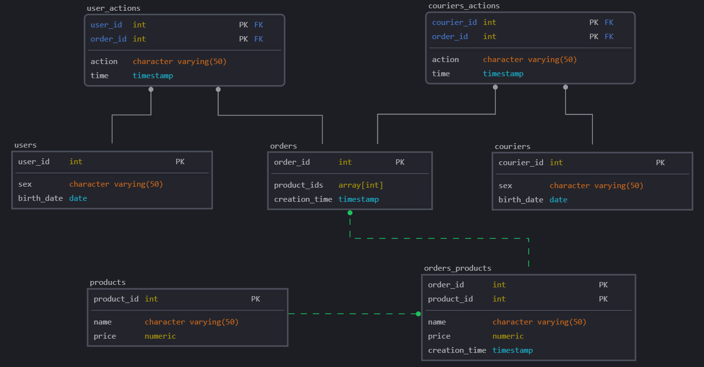
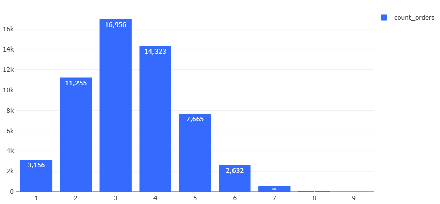
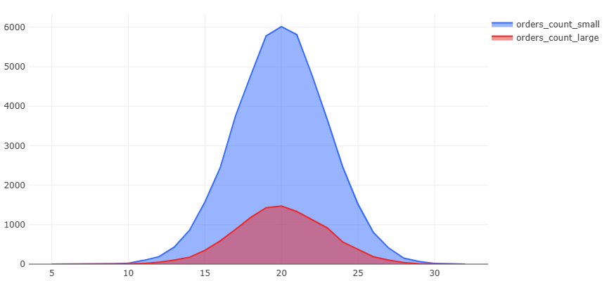

# 📊 Анализ данных E-commerce сервиса доставки на SQL

[](https://www.postgresql.org/)
[](https://powerbi.microsoft.com/)

Проект аналитики данных онлайн-сервиса доставки товаров с полным циклом исследований: от первичного анализа данных до построения дашбордов.

## 🎯 Цели проекта
1. Провести исследовательский анализ данных (EDA) для выявления общих ключевых закономерностей в поведении пользователей и временных трендов бизнес-показателей

2. Реализовать расчет основных продуктовых метрик:
   - Коэффициент конверсии (CR)
   - DAU, WAU, MAU
   - Средний чек (AOV)
   - Retention Rate
   - LTV и CAC (где применимо)

3. Проверить статистические гипотезы:
   - Сравнение средних значений ключевых метрик между группами
   - Оценка значимости различий (t-тест и p-value)
   
4. Демонстрация навыков написания SELECT-запросов разного уровня сложности с  ипользованием: фильтрации, группировки, сортировки, объединений (joins), позапросов и CTE и оконных функций. Также применение транзакций и оптимизации запросов. 

## 🛠 Технологический стек
| Категория       | Инструменты                          |
|-----------------|--------------------------------------|
| База данных     | PostgreSQL 16                        |
| Аналитика       | SELECT-запросы, CTE, оконные функции    |
| Визуализация    | Redash (экспресс-анализ), Power BI (финальные дашборды) |
| Дополнительно   | Python (Jupyter Notebook) для предобработки данных |

## 📁 Описание датасета
Данные от учебного E-commerce сервиса доставки товаров. 
__Состав данных__:

| Таблица           | Описание                                 |  Поля                |
|-------------------|-----------------------------------------|------------------------------|
| `orders`          | Заказы                                  | order_id, creation_time, product_ids |
| `users`           | Пользователи                            | user_id, sex, birth_date |
| `couriers`           | Курьеры                            | courier_id, sex, birth_date |
| `products`        | Товарный каталог                        | product_id, name, price |
| `courier_actions`      | Действия курьеров                         | order_id, courier_id, action, time |
| `user_actions`    | Действия пользователей                  | order_id, user_id, action, time|

__ER-диограмма__:




Общедоступный набор данных взят из материалов  [Симулятора SQL](https://karpov.courses/simulator-sql?_gl=1*rssps2*_ga*MjExOTE4NjQ3OS4xNzM5ODMwMzAy*_ga_DZP7KEXCQQ*MTc0MjY2MTMzOS4xMzMuMS4xNzQyNjYxMzc1LjI0LjAuMA..).

## 🚀 Исследование
### 1. Анализ среднего времени доставки
> __Постановка задачи__: Вычислить среднее время доставки для двух групп заказов --- "больших" и "малых" --- и сравнить их, определить является разница статистически значимой.

- Сперва узнаем количество неотмененных заказов, и вычисления будет проводить только для таких заказов:
```sql
with u2 AS (
    SELECT COUNT(DISTINCT order_id) AS all_orders
    FROM user_actions
)

SELECT  COUNT(u1.order_id) AS uncancelled_orders, 
        (SELECT * FROM u2) -  COUNT(u1.order_id) AS cancelled_orders,
        (SELECT * FROM u2),
        COUNT(u1.order_id)::NUMERIC / (SELECT * FROM u2) * 100 AS percantage_of_uncancelled
FROM user_actions u1
WHERE order_id NOT IN (
    SELECT order_id FROM user_actions
    WHERE action = 'cancel_order'
)
```
| uncancelled_orders | cancelled_orders | all_orders | percantage_of_uncancelled |
|--------------------|------------------|------------|---------------------------|
| 56616              | 2979             | 59595      | 95.00125849484017         |

- **Максимальное и мнимальное количество товаров в заказах** для проверки на выбросы:
```sql
SELECT  MIN(array_length(product_ids, 1)) AS min_order_size,
        MAX(array_length(product_ids, 1)) AS max_order_size
FROM orders
WHERE order_id NOT IN (
    SELECT order_id FROM user_actions
    WHERE action = 'cancel_order'
)
```
| min_order_size | max_order_size |  
|--------------------|------------|
|              1 | 9 

- **Анализ распределения количества товаров**: Теперь поймем, какие заказы считать "большими" и "малыми". Построим гистограмму распределения количества заказов по количеству товаров в заказах. Найдем статистические показатели, и выберем в качестве порога для больших заказов 75%-квартиль:
```sql
with count_goods AS (
    SELECT  order_id, 
            array_length(product_ids, 1) AS order_size,
            MAX(array_length(product_ids, 1)) OVER() AS max_order_size,
            MIN(array_length(product_ids, 1)) OVER() AS min_order_size
    FROM orders
    WHERE order_id NOT IN (
        SELECT order_id FROM user_actions
        WHERE action = 'cancel_order'
    )
    ORDER BY order_id
    
), stats AS (
    SELECT  PERCENTILE_CONT(0.75) WITHIN GROUP (ORDER BY order_size) AS percentile,
            ROUND(AVG(order_size), 2) AS avg_order_size
    FROM count_goods
)


SELECT  order_size,
        COUNT(order_id) AS count_orders,
        ROUND(COUNT(order_id) / SUM(COUNT(order_id)) OVER() * 100, 2) AS quantity_percent,
        SUM(COUNT(order_id)) OVER() AS all_orders,
        (SELECT percentile FROM stats) AS perc_75,
        (SELECT avg_order_size FROM stats) AS avg_order_size
FROM count_goods
GROUP BY order_size
ORDER BY order_size ASC
```
| order_size | count_orders | quantity_percent | all_orders | perc_75 | avg_order_size |
|------------|--------------|------------------|------------|---------|----------------|
| 1          | 3156         | 5.57             | 56616      | 4.0     | 3.4            |
| 2          | 11255        | 19.88            | 56616      | 4.0     | 3.4            |
| 3          | 16956        | 29.95            | 56616      | 4.0     | 3.4            |
| 4          | 14323        | 25.3             | 56616      | 4.0     | 3.4            |
| 5          | 7665         | 13.54            | 56616      | 4.0     | 3.4            |
| 6          | 2632         | 4.65             | 56616      | 4.0     | 3.4            |
| 7          | 556          | 0.98             | 56616      | 4.0     | 3.4            |
| 8          | 68           | 0.12             | 56616      | 4.0     | 3.4            |
| 9          | 5            | 0.01             | 56616      | 4.0     | 3.4            |


Как видим, количество больших заказов составляет чуть менее 20% от общего числа заказов.
- Расчитаем среднее времени доставки и пометим заказы как большие и малые:
```sql
with tab AS (
    SELECT order_id
    FROM   courier_actions
    WHERE  action = 'accept_order'

        AND order_id not in (
            SELECT order_id
            FROM   user_actions
            WHERE  action = 'cancel_order')
)  

SELECT  order_id,
        CASE 
            WHEN array_length(product_ids, 1) > 5 THEN 'large' 
            ELSE 'small' 
        END AS order_size,
        MIN(time) as time_accepted,
        MAX(time) as time_delivered,
        DATE(MIN(time)) AS start_date,
        ROUND(extract(epoch FROM age(max(time), min(time)))::decimal / 60, 0)::INTEGER AS delivery_time
FROM   courier_actions
LEFT JOIN orders USING(order_id) 
WHERE  order_id in (SELECT order_id FROM tab)
GROUP BY order_id, product_ids
ORDER BY order_id
```
| order_id | order_size | time_accepted  | time_delivered | delivery_time |
|----------|------------|----------------|----------------|---------------|
| 1        | small      | 24/08/22 01:52 | 24/08/22 02:15 | 24            |
| 2        | small      | 24/08/22 06:37 | 24/08/22 06:56 | 18            |
| 3        | small      | 24/08/22 07:35 | 24/08/22 07:54 | 19            |
| 4        | small      | 24/08/22 10:39 | 24/08/22 10:58 | 19            |
| 5        | small      | 24/08/22 12:34 | 24/08/22 12:59 | 24            |

Посмотрим на изменение среднего времени доставки всех заказов по дням, добавив запрос:
```sql
SELECT  DATE(time_accepted) AS start_date,
        AVG(delivery_time) AS avg_delivery_time
FROM time
GROUP BY start_date
ORDER BY start_date

```


Теперь посчитаем статистические показатели для обоих групп:
```sql
SELECT  PERCENTILE_CONT(0.5) WITHIN GROUP (ORDER BY delivery_time) AS median,

    -- small orders
    COUNT(CASE WHEN order_size = 'small' THEN 1 END) AS orders_count_small,
    ROUND(AVG(CASE WHEN order_size = 'small' THEN delivery_time END), 2) AS mean_small,
    STDDEV(CASE WHEN order_size = 'small' THEN delivery_time END) AS std_small,
    MIN(CASE WHEN order_size = 'small' THEN delivery_time END) AS min_small,
    MAX(CASE WHEN order_size = 'small' THEN delivery_time END) AS max_small,
    
    -- large orders
    COUNT(CASE WHEN order_size = 'large' THEN 1 END) AS orders_count_large,
    ROUND(AVG(CASE WHEN order_size = 'large' THEN delivery_time END), 2) AS mean_large,
    STDDEV(CASE WHEN order_size = 'large' THEN delivery_time END) AS std_large,
    MIN(CASE WHEN order_size = 'large' THEN delivery_time END) AS min_large,
    MAX(CASE WHEN order_size = 'large' THEN delivery_time END) AS max_large
    
FROM time
```

| median | orders_count_small | mean_small | std_small          | min_small | max_small | orders_count_large | mean_large | std_large         | min_large | max_large |
|--------|--------------------|------------|--------------------|-----------|-----------|--------------------|------------|-------------------|-----------|-----------|
| 20.0   | 45690              | 19.96      | 3.03 | 5         | 32        | 10926               | 20.04      | 3.00 | 10        | 30        |

Замечаем, что медианное значение и среднее практически не отличаются, а среднее время доставки для двух групп практически одинаковое. Если построим гистограмму количества заказов по количеству минут, затраченных на доставку, для обоих групп, то увидим явно выраженное __нормальное распределение__:
```sql
SELECT  delivery_time,
        COUNT(order_id) FILTER (WHERE order_size = 'large') as orders_count_large,
        COUNT(order_id) FILTER (WHERE order_size = 'small') as orders_count_small
FROM time
GROUP BY delivery_time
ORDER BY delivery_time
```



- __Проведение статистического теста в SQL__

	- Итак, средние в двух группах `19.86` и `20.16`, что вряд ли имеет практическую значимость для бизнеса. Но в эксперементальных учебных целях проведем __z-тест__ с использованием и оценим статистическую и практическую значимость различий непосредственно в SQL, используя необходимые формулы, что необычно, ведь статистические тесты проводятся обычно с помощью Python (scipy, stats, pandas). 
	- Проводим __двусторонний независимый z-тест__, поскольку: 
		- Размер группы с "большими" заказами составляет `> 10%` данных, что позволяет провести достаточно надежный статистический тест;
		-   Выборки независимые;
    
		-   Данные нормально распределены;
    
		-   Объёмы выборок очень большие (n > 30)
		- Результаты  на больших n практически совпадают с результатами __t-теста__, но в случае __z-теста__ расчеты гораздо проще реализовать в SQL.
		
	- **Формулировка гипотез:**

		-   **$H_0$:**  Среднее время доставки одинаково для обеих групп ($avg_1 = avg_2$).
    
		-   **$H_1$:**  Среднее время доставки различается ($avg_1 \neq avg_2$).
	
	- **Уровень значимости ($\alpha$)**  — это вероятность отвергнуть нулевую гипотезу ($H_0$), когда она верна (ошибка I рода):
		- **Стандартный выбор:**  $\alpha = 0.05$  (5%) →  **95% доверительный интервал**. 

        - **Доверительный интервал**:

  $$\text{DI} = (\bar{X}_1 - \bar{X}_2) \pm z_{\alpha/2} \cdot SE$$

  где `$z_{\alpha/2} \approx 1.96$` - критическое значение z-критерия для двустороннего теста с α = 0.05 (для 95% ДИ), `$SE$` - стандартная ошибка разницы средних:

  $$SE = \sqrt{\frac{s_1^2}{n_1} + \frac{s_2^2}{n_2}}$$

	- **z-статистика**:

  $$z = \frac{\bar{X}_1 - \bar{X}_2}{SE}$$

	- **p-value**:

  $$p\text{-value} = 2 \cdot (1 - \Phi(|z|))$$
	
	- **Размер эффекта Cohen’s d** - стандартизированная мера размера эффекта, которая помогает понять, **насколько важны различия между группами** не только с точки зрения статистики, но и с точки зрения практической ценности:

  $$d = \frac{|\bar{X}_1 - \bar{X}_2|}{s_{\text{pooled}}}$$
		
	Где:

  $$s_{\text{pooled}} = \sqrt{\frac{(n_1 - 1)s_1^2 + (n_2 - 1)s_2^2}{n_1 + n_2 - 2}}$$
		
	- Из-за отсутсвия поддержки функции CDF проведем **аппроксимацию Абрамовица и Стегуна** прямо в SQL-запросе по формуле:

  $$\Phi(z) \approx \begin{cases} 1 - \phi(z) \cdot \left(a_1 t + a_2 t^2 + a_3 t^3 + a_4 t^4 + a_5 t^5\right), & z \geq 0 \\\phi(z) \cdot \left(a_1 t + a_2 t^2 + a_3 t^3 + a_4 t^4 + a_5 t^5\right), & z < 0 \end{cases}$$
   
	- Целиком весь запрос:

```sql
with tab AS (
    SELECT order_id
    FROM   courier_actions
    WHERE  action = 'accept_order'
        AND order_id not in (
            SELECT order_id
            FROM   user_actions
            WHERE  action = 'cancel_order')

), time AS (
    SELECT  order_id,
            CASE 
                WHEN array_length(product_ids, 1) > 5 THEN 'large' 
                ELSE 'small' 
            END AS order_size,
            MIN(time) as time_accepted,
            MAX(time) as time_delivered,
            DATE(MIN(time)) AS start_date,
            ROUND(extract(epoch FROM age(max(time), min(time)))::decimal / 60, 0)::INTEGER AS delivery_time
    FROM   courier_actions
    LEFT JOIN orders USING(order_id) 
    WHERE  order_id in (SELECT order_id FROM tab)
    GROUP BY order_id, product_ids
    ORDER BY order_id
    
), avg_vs_date AS (
    SELECT  start_date,
            AVG(delivery_time) AS avg_delivery_time
    FROM time
    GROUP BY start_date
    ORDER BY start_date

), orders_count_via_time AS (
    SELECT  delivery_time,
            COUNT(order_id) FILTER (WHERE order_size = 'large') as orders_count_large,
            COUNT(order_id) FILTER (WHERE order_size = 'small') as orders_count_small
    FROM time
    WHERE delivery_time > 4
    GROUP BY delivery_time
    ORDER BY delivery_time

), stats AS (
    SELECT  PERCENTILE_CONT(0.5) WITHIN GROUP (ORDER BY delivery_time) AS median,

        -- small orders
        COUNT(CASE WHEN order_size = 'small' THEN 1 END) AS orders_count_small,
        ROUND(AVG(CASE WHEN order_size = 'small' THEN delivery_time END), 2) AS mean_small,
        STDDEV(CASE WHEN order_size = 'small' THEN delivery_time END) AS std_small,
        MIN(CASE WHEN order_size = 'small' THEN delivery_time END) AS min_small,
        MAX(CASE WHEN order_size = 'small' THEN delivery_time END) AS max_small,
        
        -- large orders
        COUNT(CASE WHEN order_size = 'large' THEN 1 END) AS orders_count_large,
        ROUND(AVG(CASE WHEN order_size = 'large' THEN delivery_time END), 2) AS mean_large,
        STDDEV(CASE WHEN order_size = 'large' THEN delivery_time END) AS std_large,
        MIN(CASE WHEN order_size = 'large' THEN delivery_time END) AS min_large,
        MAX(CASE WHEN order_size = 'large' THEN delivery_time END) AS max_large
        
    FROM time
    
), z_test AS (
    SELECT
        mean_small,
        mean_large,
        SQRT(
            (std_small^2 * orders_count_small + std_large^2 * orders_count_large)
            / (orders_count_small + orders_count_large)
        ) AS pooled_std,
        SQRT(POWER(std_small, 2)/orders_count_small + POWER(std_large, 2)/orders_count_large) AS se,
        (mean_large - mean_small) / (SQRT(POWER(std_small, 2)/orders_count_small + POWER(std_large, 2)/orders_count_large)) AS z_score,
        1 / (1 + 0.2316419 * ABS((mean_large - mean_small) / (SQRT(POWER(std_small, 2)/orders_count_small + POWER(std_large, 2)/orders_count_large)))) AS t 
    FROM stats
)

-- SELECT * FROM stats;

-- SELECT * FROM time;

SELECT
  -- Разница средних
  mean_large - mean_small AS mean_diff,
  
  -- Cohen’s d
  ABS(mean_large - mean_small) / pooled_std AS cohen_d,
  
  -- 95% ДИ
  (mean_large - mean_small) - 1.96 * se AS ci_lower,
  (mean_large - mean_small) + 1.96 * se AS ci_upper,
  
  -- z-статистика и p-value
  z_score,
  2 * (1 - (
    CASE 
        WHEN z_score >= 0 THEN
            1 - (1 / SQRT(2 * PI())) * EXP(-(z_score^2)/2) * 
            (0.319381530 * t - 0.356563782 * t^2 + 1.781477937 * t^3 - 1.821255978 * t^4 + 1.330274429 * t^5)
        ELSE
            (1 / SQRT(2 * PI())) * EXP(-(z_score^2)/2) * 
            (0.319381530 * t - 0.356563782 * t^2 + 1.781477937 * t^3 - 1.821255978 * t^4 + 1.330274429 * t^5)
    END
    )) AS p_value
  
FROM z_test
```
- Результат:

	| mean_diff | cohen_d              | ci_lower             | ci_upper            | z_score            | p_value             |
	|-----------|----------------------|----------------------|---------------------|--------------------|---------------------|
	| 0.08      | 0.026  | -0.026| 0.20 | 1.47 | 0.14 |

- Выводы:
	- Так как  **1.48 < z_crit = 1.96**, разница  **не достигает статистической значимости**  на уровне 5%.
	- **p-value = 0.14 > 0.05** - вероятность получить такую разницу (или больше) между группами, если на самом деле её нет (нулевая гипотеза верна), составляет **14%**. →  **нет оснований отвергать нулевую гипотезу**.
	- Разница статистически **не значима**.
	- Размер эффекта составляет **0.03 стандартных отклонения < 0.2** - -   → эффект  **пренебрежимо мал**. Даже если бы разница была значимой, её  **практический смысл отсутствует**.

 
 ## 2. 
